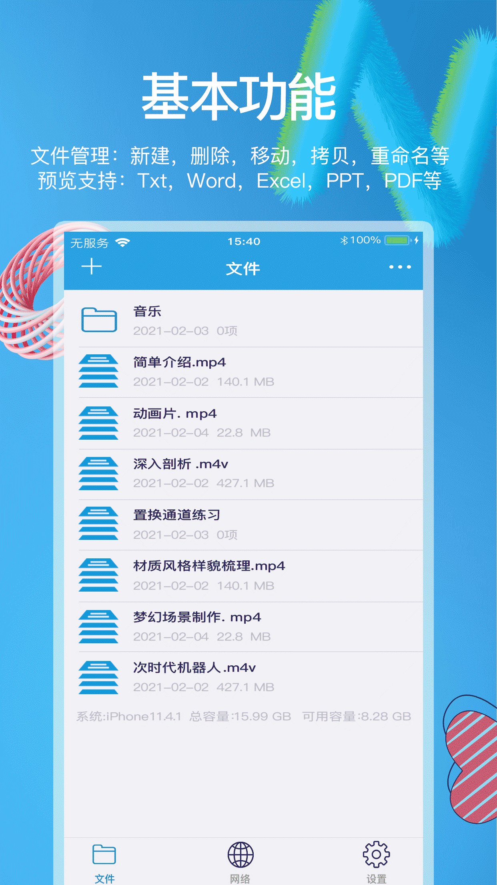
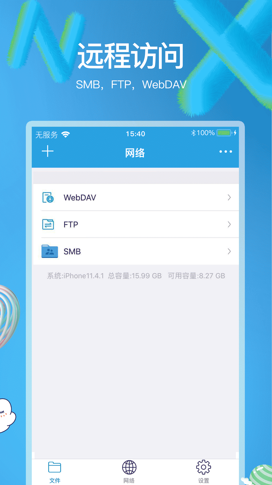

# NXPlayer是一款支持多种格式的视频播放软件，不仅可以本地播放，还可以网络播放。

## 基本功能
* 文件管理：新建，删除，移动，拷贝，重命名等
* 预览支持：Txt，Word，Excel，PPT，PDF等

## 多种传输
* 多种传输：Wifi传输，iTunes传输，相册导入，浏览导入

## 倍速播放
* 变速播放：0.75倍、1.0倍、1.25倍、1.5倍、2.0倍，可以快速或慢速播放

## 远程访问

## 超级强大

## 联系我们
* 联系邮箱：zhulongfei28@gmail.com

